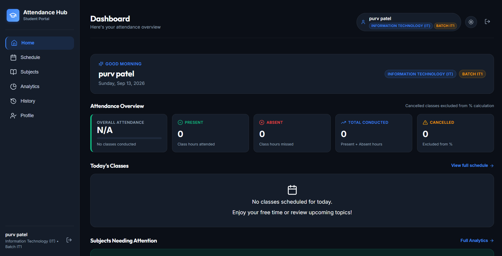
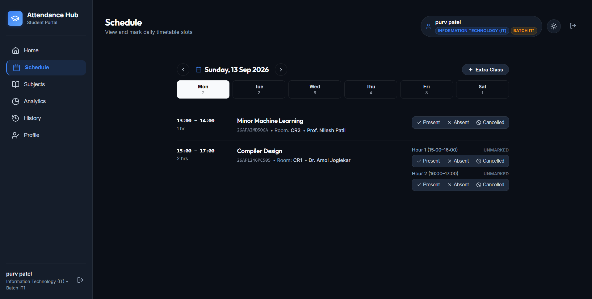
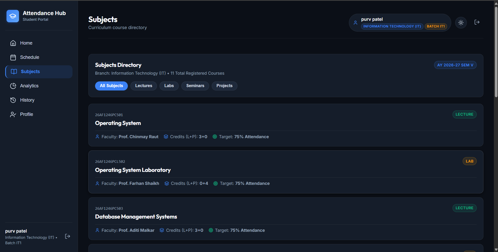
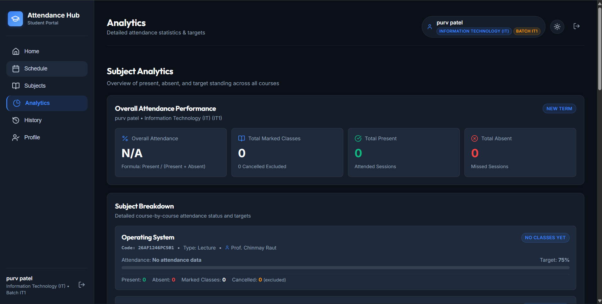
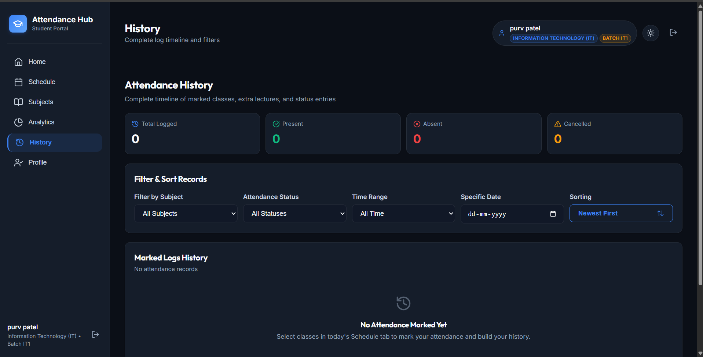
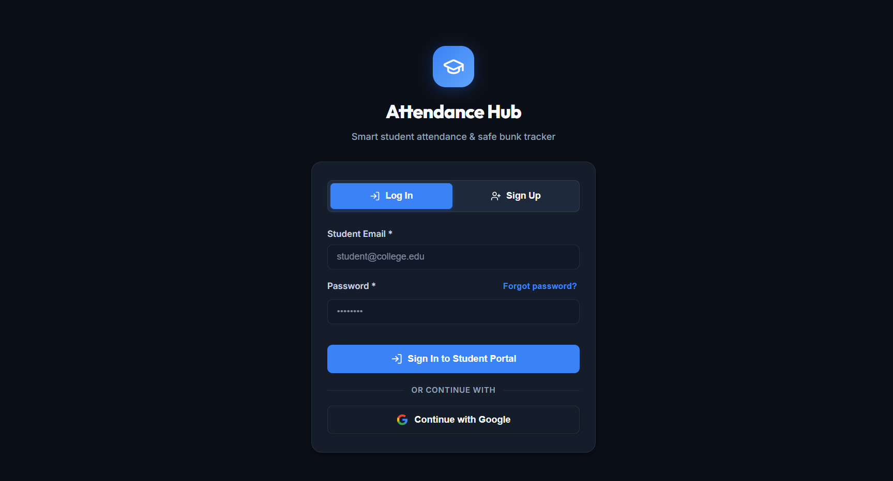

<div align="center">

# 📊 Attendance Tracker

### A smarter way to track attendance, subjects, timetables and academic progress.

<p>
  <a href="https://attendance-tracker-phi-inky.vercel.app/">
    <strong>🚀 Live Demo</strong>
  </a>
  &nbsp; • &nbsp;
  <a href="#-features">Features</a>
  &nbsp; • &nbsp;
  <a href="#-getting-started">Setup</a>
</p>


<br />
<br />



</div>

---

## 🧠 What is Attendance Tracker?

**Attendance Tracker** is a student-focused web application built to make attendance management simple, clear and less stressful.

Instead of manually calculating attendance, checking multiple timetables or guessing how many lectures you can miss, students can manage everything from one place.

> **Track your attendance. Understand your academics. Stay above the required percentage.**

Built with a clean interface, real account-based authentication and branch-specific academic data.

---

## ✨ Features

### 🔐 Secure Student Authentication

* Google OAuth login
* Email and password authentication
* Account-based student access
* Protected application routes

### 🧾 Mandatory Student Profile

Students complete their profile during onboarding:

* Full name
* Roll number
* Branch
* Practical batch

No random default values. No mystery profile data. Humanity has suffered enough from badly configured forms.

### 📈 Smart Dashboard

* Overall attendance percentage
* Subject-wise attendance cards
* Quick attendance marking
* Academic overview at a glance
* Visual attendance status

### 📊 Attendance Analytics

* Subject-wise attendance breakdown
* Minimum attendance threshold tracking
* Attendance target calculations
* Helps students understand how many lectures they can attend or miss

### 🗓️ Timetable Management

* Daily timetable
* Weekly timetable
* Branch-specific schedules
* Practical batch-based timetable filtering
* Automatic subject mapping

### 📚 Subjects Directory

View academic subject information including:

* Subject name
* Course code
* Credits
* Subject type
* Faculty details

### 🕘 Attendance History

* View previously marked attendance
* Paginated attendance records
* Filter attendance history
* Review subject-wise records

### 🎨 Modern User Experience

* Light and dark mode
* Responsive design
* Clean student-focused interface
* Mobile-friendly layouts
* Fast Vite-powered development

---

## 🖥️ Screenshots

### Dashboard


### Schedule



### Subjects



### Analytics



### Attendance History



### Login



---

## 🔄 How It Works

```text
Create Account
      ↓
Complete Student Profile
      ↓
Select Branch & Practical Batch
      ↓
View Subjects and Timetable
      ↓
Mark Daily Attendance
      ↓
Track Analytics and Attendance History
```

The selected branch and practical batch determine the student's subjects and timetable automatically.

---

## 🛠️ Tech Stack

| Technology         | Purpose                             |
| ------------------ | ----------------------------------- |
| React 18.3         | Frontend UI                         |
| Vite 6.1           | Development and build tooling       |
| JavaScript ES6+    | Application logic                   |
| CSS3               | Styling and responsive layouts      |
| Supabase           | Authentication and backend services |
| PostgreSQL         | Database                            |
| Google OAuth       | Authentication provider             |
| Row Level Security | Data protection                     |

---

## 🚀 Getting Started

### 1. Clone the Repository

```bash
git clone https://github.com/Purvpatel1/attendance-tracker.git
cd attendance-tracker
```

### 2. Install Dependencies

```bash
npm install
```

### 3. Configure Environment Variables

Create a `.env` file in the root directory:

```env
VITE_SUPABASE_URL=your_supabase_project_url
VITE_SUPABASE_ANON_KEY=your_supabase_anon_key
```

### 4. Configure Supabase

1. Create a Supabase project.
2. Add the required database tables using:

```text
supabase/schema.sql
```

3. Apply the onboarding migration:

```text
supabase/migrations/20260913_fix_onboarding_trigger.sql
```

4. Configure authentication providers.
5. Enable the required Row Level Security policies.

### 5. Start the Development Server

```bash
npm run dev
```

The application will be available at:

```text
http://localhost:5173
```

---

## 🌐 Live Application

Try the deployed application:

### [🚀 Open Attendance Tracker](https://attendance-tracker-phi-inky.vercel.app/)

---

## 🎯 Project Goals

Attendance Tracker was built to solve common student problems:

* Manually calculating attendance
* Losing track of subject-wise percentages
* Checking multiple timetable documents
* Forgetting attendance history
* Not knowing whether attendance is above the required threshold

The goal is simple: **make academic attendance easier to understand and manage.**

---

## 👨‍💻 Author

<div align="center">

### Purv Patel

IT Engineering Student
SVKM’s Shri Bhagubhai Mafatlal Polytechnic and College of Engineering

<p>
  <a href="https://github.com/Purvpatel1">
    GitHub Profile
  </a>
</p>

</div>

---

<div align="center">

### Built with React, Supabase and a suspicious amount of debugging.

⭐ If you find this project useful, consider starring the repository.

</div>
